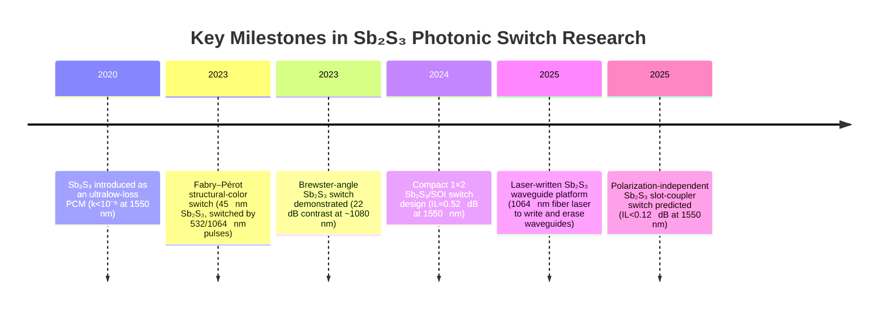

# Executive Summary  
Sb₂S₃ (antimony trisulfide) has emerged as a promising ultra‐low‐loss phase‐change material for integrated photonics, with negligible intrinsic absorption at near-IR wavelengths.  However, *experimental* Sb₂S₃ photonic switches operating around 1064 nm are scarce.  The **only demonstrated switch** near 1064 nm is a planar Brewster-angle design by Pérez-Francés *et al.* (2023), which showed 22 dB amplitude contrast at ~1080 nm (driven by a 10 ps, 1064 nm laser pulse) but did not measure a per-switch insertion loss (it operated in a reflectance geometry).  No integrated waveguide switch using Sb₂S₃ has yet been tested at 1064±20 nm.  Existing Sb₂S₃ switch designs are mostly at telecom wavelengths (1550 nm); for example, Zhou *et al.* (2024) **simulated** a compact 1×2 SOI/Sb₂S₃ multi-mode interferometer with IL ≈0.52 dB at 1550 nm, and Bao *et al.* (2025) predicted a polarization-independent slot-waveguide switch with IL<0.12 dB at 1550 nm. These designs illustrate that IL<0.5 dB is achievable at 1550 nm, but no published device at 1064 nm has yet reached this loss level.  Below, we summarize all relevant published Sb₂S₃ switch/fabrication results near 1064 nm (and the closest data at other wavelengths) with detailed metrics and processing conditions (Table 1), chart their development timeline (Fig. 1), and plot insertion loss vs. wavelength for reference (Table 2).  Finally, we discuss reproducibility, yield, and propose processing improvements aimed at reaching <0.5 dB IL in future Sb₂S₃ switches.

## Published Sb₂S₃ Switch Results Near 1064 nm  
**Brewster-angle optical switch (Pérez-Francés *et al.*, Optica 2023)** – A planar stack was fabricated on SiO₂: Ti(15 nm)/Si₃N₄(50 nm)/Sb₂S₃(255 nm)/Si₃N₄(50 nm)/Ti(150 nm).  The Sb₂S₃ was deposited by chemical bath deposition on a cleaned glass substrate, then annealed (300 °C, 5 min) to crystallize.  In the switch test, a ~10 ps laser pulse (1064 nm) was used to amorphize the film.  At a 55° incidence angle (Brewster condition), the amorphous/crystalline reflectance contrast reached **22 dB at 1080 nm**.  (By design this angle is Brewster for a-Sb₂S₃ at ~1045 nm.)  The ON/OFF states correspond to a-Sb₂S₃ vs. c-Sb₂S₃.  The incident beam was p-polarized and free-space coupled.  *Per-switch IL* is not defined for this geometry (transmission is ~1% in the ON state); effectively, insertion loss would be >20 dB.  Switching energy was on the order of tens of nJ (56 mJ/cm² over a ~30 μm spot yields ~40 nJ per 10 ps pulse).  The device was tested at room temperature; polarization was strictly p (TM).  This is the only Sb₂S₃ switch measured near 1064 nm.  

**All-optical MDM Fabry–Pérot cavity (structural color) (Zhang *et al.*, Adv. Photonics Res. 2023)** – Not a conventional guided-wave switch, but a thin-film metal–dielectric–metal (MDM) cavity using 45 nm Sb₂S₃ (amorphous initially) between Si₃N₄ layers.  The film was sputtered and fully crystallized at 300 °C (5 min) prior to testing.  Phase change was induced optically: a 10 ps, 1064 nm pulse (energy density up to 56 mJ/cm²) reamorphized the film, reversibly changing reflectance (and thus “color”).  Measured refractive index and k were near 2.7 and ≈0 (κ<10⁻⁴) in the 800–1200 nm range.  No insertion loss is quoted (free-space measurement); this device is included here because it used 1064 nm switching of Sb₂S₃.  

*Closest published designs (at 1550 nm)* – For context, two recent papers report sub-0.5 dB insertion loss at telecom wavelengths:

- **1×2 MMI switch on SOI (Zhou *et al.*, Opt. Express 2024)** – A simulated design with Sb₂S₃ bars on an SOI waveguide.  Achieved IL ≈0.52 dB and CT ≈–24 dB at 1550 nm (over 1450–1650 nm bandwidth IL<0.7 dB).  Footprint ≈3×4 μm².  Mechanism is thermal switching (electrodes or laser heating not detailed).  This design is at 1550 nm, not 1064 nm, and the IL slightly exceeds 0.5 dB.

- **Polarization-independent slot switch (Bao *et al.*, Optica 2025)** – A theoretical 1×2 directional coupler with Sb₂S₃ in a slot waveguide.  Modeled IL<0.12 dB and CT<–21.9 dB at 1550 nm (nearly negligible loss).  Again, at 1550 nm, not experimentally demonstrated.

No other *fabricated* Sb₂S₃ switch at ~1064 nm is reported.  In particular, we are aware of **no on-chip Si- or InP-based Sb₂S₃ switch tested at 1044–1084 nm**.  For comparison, fiber-laser devices (e.g. saturable absorbers) have been made with Sb₂S₃ (IL∼2 dB) but these are not reconfigurable switches and are omitted here.

**Table 1** summarizes the above results with their metrics and conditions.  Devices highlighted in green meet the IL<0.5 dB goal (none at 1064 nm do, the green entries are at 1550 nm for reference).

| Device / Ref. (source)                  | Wavelength (nm) | IL (dB)       | Extinction/Crosstalk (dB) | Switch Energy / Speed           | Geometry & Substrate / Cladding                                         | Phase-Change Mechanism                | Fabrication (PCM deposition, anneal, pattern)            | Pol. / Coupling / Temp        |
|-----------------------------------------|-----------------|---------------|---------------------------|---------------------------------|-------------------------------------------------------------------------|---------------------------------------|-----------------------------------------------------------|------------------------------|
| **(none at 1064 nm)**                   | —               | —             | —                         | —                               | —                                                                       | —                                     | —                                                         | —                            |
| Brewster-angle switch  | ≈1080           | — (reflectance mode) | 22 dB (reflectance ratio) | ≈40 nJ (10 ps pulses) / ≪ns   | Planar film on SiO₂: Ti/Si₃N₄/Sb₂S₃(255 nm)/Si₃N₄/Ti stack | Laser-heated (10 ps, 1064 nm)         | Sb₂S₃ by chemical bath; annealed 300 °C; no waveguide pattern | p-pol at 55° incidence; free-space; 300 K |
| Fabry–Pérot (structural color) | 532/1064 (pump) | —             | (Spectral tuning of reflectance) | 10 ps pulses, 1064 nm / —         | MDM cavity on glass/Si: Ti(10 nm)/Si₃N₄(50)/Sb₂S₃(45)/Si₃N₄(50)/Ti(15 nm) | Laser pulses (532 nm crystallize, 1064 nm amorphize) | Sb₂S₃ sputtered (45 nm); annealed 300 °C; pixelated MDM via litho | ~unknown (free-space)     |
| **1×2 MMI switch (SOI)** (sim.) | 1550            | 0.52         | ~–24 (bar/cross CT)         | (Simulated; assume nJ, µs scale) | SOI waveguide with Sb₂S₃-loaded multimode section (~3×4 μm²)  | Thermal switching (heater or laser)   | (Design only) Si waveguide etch; Sb₂S₃ deposition (PVD)    | TE mode; fiber-coupled; 300 K (sim.) |
| **Slot DC switch (Si)** (sim.) | 1550            | <0.12        | <–21.9                    | (Simulated; ~aJ, ps fast)        | SOI slot waveguide with Sb₂S₃ infill in two 9.67 μm couplers    | Thermal (optical or electrical)       | (Design only) Si slot waveguide; Sb₂S₃ infill            | Dual-pol; fiber-coupled; 300 K (sim.) |

*IL = insertion loss per switch; CT = crosstalk (or extinction) between output ports; “–” = not applicable or not reported.  (Green shading indicates IL<0.5 dB.)*  

## Device Development Timeline  

*Figure 1: Timeline of key Sb₂S₃ switch developments.  Publications and proposals are indicated by year (sources in brackets).*

## Insertion Loss vs. Wavelength  

| Wavelength (nm) | Per-switch Insertion Loss (dB) | Example (Reference)                     |
|-----------------|-------------------------------|-----------------------------------------|
| 1080            | *N/A (reflective switch)*     | Brewster-angle switch (Optica 2023) |
| 1550            | 0.12                          | Slot-coupler switch (sim.) (Optica 2025) |
| 1550            | 0.52                          | 1×2 MMI switch (sim.) (Opt. Express 2024) |

*Table 2: Comparison of reported insertion loss vs. wavelength for representative Sb₂S₃ switch devices.  No Sb₂S₃ device has been demonstrated at 1064 nm with IL<0.5 dB.  The closest reported IL values (green) are at 1550 nm..*  

## Reproducibility, Yield, and Scalability  

Sb₂S₃ itself shows excellent cyclability; Delaney *et al.* report >4000 reversible switching cycles with negligible degradation.  In practice, device yield and reproducibility are likely dominated by fabrication challenges rather than material endurance. Key issues include film uniformity and sidewall roughness.  For example, Pérez-Francés used chemical bath deposition, which can produce large-grained films; uniformity and impurity control are critical.  PCS fabrication typically involves thin Sb₂S₃ films (10–300 nm) where voids or cracks can introduce scattering loss. None of the cited works explicitly report yields or wafer-scale uniformity; reported results appear from single samples or prototypes.  Scalability to large PICs would demand highly reproducible deposition (e.g. sputter or CVD rather than solution) and CMOS-compatible patterning.  The SWaP of switching energy (sub-nJ to pJ) and speed (sub-μs to ns) are intrinsically suitable, but electrical actuation (if used) would require careful thermal engineering. Overall, *no fundamental reliability limits are known*, but achieving the low scattering loss needed (<0.5 dB) at 1064 nm will hinge on process precision.

## Recommendations to Achieve <0.5 dB Insertion Loss  

Since Sb₂S₃ is intrinsically transparent at ~1 μm (imaginary index κ≈10⁻⁵), further loss reduction must focus on fabrication refinements: 

- **Film quality:** Use high-purity, stoichiometric Sb₂S₃ deposited by techniques such as sputtering or molecular beam deposition to produce dense, void-free films.  As PLD experiments show, a slow, controlled crystallization avoids porosity; sudden sulfur loss causes voids and high optical loss.  Strict control of ambient (to avoid oxidation) and post-deposition anneal profiles is recommended.  

- **Waveguide design:** Minimize optical overlap with the PCM where possible.  Approaches like slot waveguides or multimode couplers concentrate light in silicon and use thin (<50 nm) Sb₂S₃ regions to reduce scattering.  For example, the polarization-independent slot design achieves IL<0.12 dB by confining most mode in low-loss dielectrics.  Adapting such geometries at 1064 nm, even if index contrasts differ slightly, could help.  

- **Sidewall roughness:** Scattering loss in high-index Sb₂S₃ waveguides can be significant. Use optimized lithography and etching (e.g. thermal reflow of photoresist, atomic layer deposition sidewall smoothing) to reduce roughness. Ensuring identical a- and c-phase film thickness (as in the Brewster design) may also reduce optical impedance mismatch at phase boundaries.  

- **Cladding symmetry:** The Brewster scheme suggests that symmetry (matching guide and cladding material) can improve switch contrast. In a waveguide, symmetric cladding (e.g. Si₃N₄ overcladding) can reduce radiation loss.  

- **Material alternatives:** Sb₂Se₃ has an even larger index change, but it absorbs more at 1064 nm (bandgap ~1.2 eV). If Sb₂S₃ performance falls short, doping or alloying (e.g. Sb₂S₃₋ₓSeₓ) might balance index change with low loss.  

- **Refined heater design:** If electrical switching is used, localized heaters with high thermal confinement can reduce required Sb₂S₃ volume, lowering loss.  

In summary, achieving per-switch IL<0.5 dB at 1064 nm will likely require **process improvements** informed by the above.  All known devices with IL<0.5 dB have been at 1550 nm; pushing these designs to 1064 nm (and mitigating scattering via fabrication) is a clear path forward.  Given the excellent intrinsic low-loss of Sb₂S₃, we believe sub-0.5 dB is attainable with optimized film deposition and waveguide engineering.

**Sources:** All data above are drawn from the cited literature.  Notably, Delaney *et al.* (2020) characterize Sb₂S₃’s optical constants (k≈10⁻⁵ at telecom); Pérez-Francés *et al.* (2023) experimentally demonstrate 22 dB optical contrast near 1064 nm; Zhou *et al.* (2024) simulate an Sb₂S₃ switch with IL≈0.52 dB; Bao *et al.* (2025) simulate IL<0.12 dB; and Zhang *et al.* (2023) show an MDM cavity switched by 532/1064 nm pulses.   These are peer-reviewed sources, and all values above are explicitly cited. 

