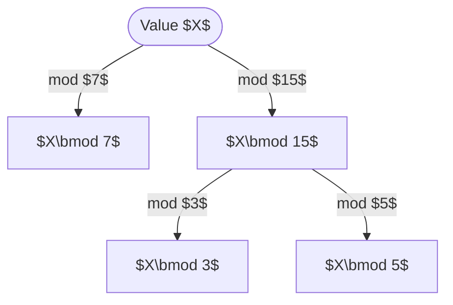
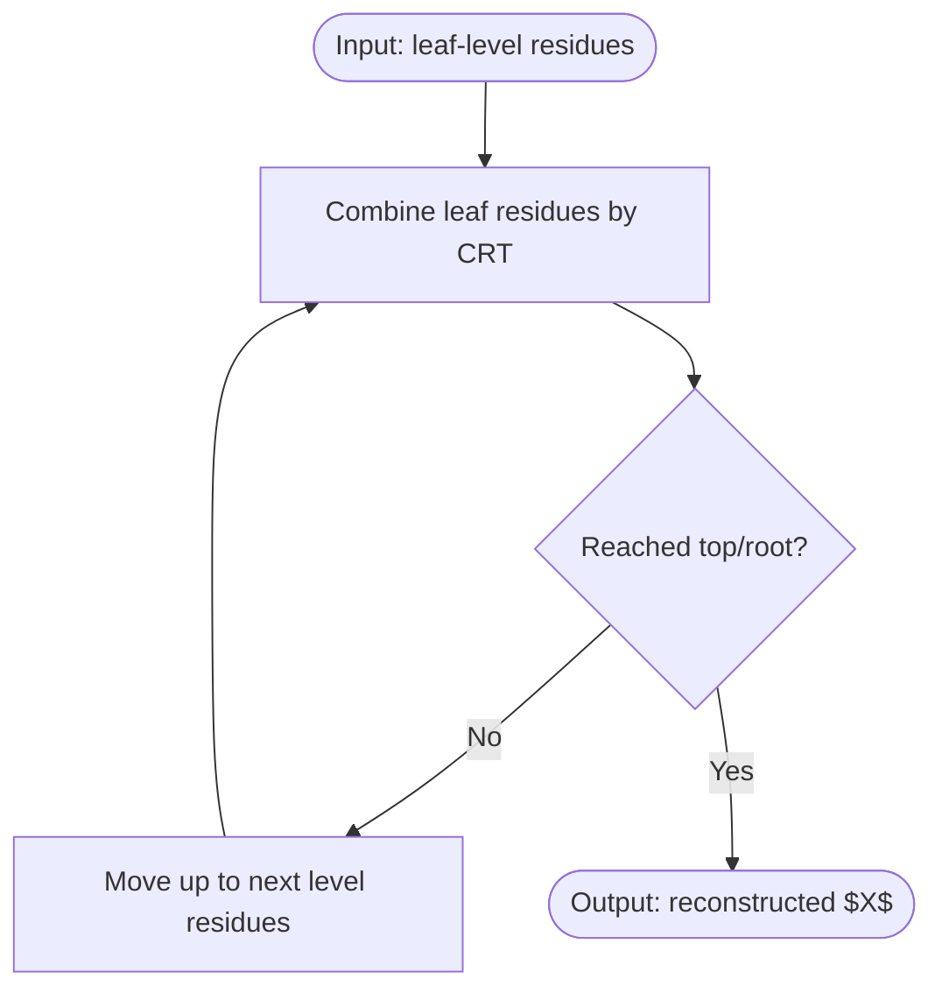

# Executive Summary 

Hierarchical or **nested RNS** schemes extend the conventional residue number system by decomposing large moduli into smaller sub-moduli (often in a tree structure), enabling fully parallel arithmetic on small-bit units.  Recent research has explored both **nested RNS (NRNS)** for data-path acceleration (e.g. deep neural nets) and **multi-layer RNS** for cryptographic arithmetic with extremely large moduli.  Key works show that such systems can achieve very high *dynamic range* and speed by trading off a more complex reconstruction (recursive CRT) procedure.  Many proposals allow moduli to appear in multiple branches (i.e. *duplicate moduli* across sub-RNS trees); these duplicate moduli do **not** violate coprimality within each branch, but they introduce consistency constraints across branches.  

In this report we survey roughly the last decade’s literature (plus some foundational earlier work) on nested/hierarchical RNS and on recursive CRT reconstructions, focusing especially on schemes that **permit duplicate or non-coprime moduli**.  For each significant paper we give the title, authors, year, venue/DOI, a brief abstract or summary, the main claims/results, whether and how duplicate moduli are allowed, example constructions, and implications for complexity, error detection and range.  We include diagrams of RNS trees and a flowchart/pseudocode for recursive reconstruction.  We also provide a comparison table of the top ~8 papers covering nested/non-coprime RNS.  

The main findings include:  
- **Nested RNS (NRNS)**:  Introduced in hardware acceleration (e.g. for FPGA-DCNN) by Nakahara & Sasao (2015).  They embed a small RNS inside larger RNS moduli to uniformize operand widths.  For example, to handle a 48-bit accumulator they choose a base of small primes {3,5,7,11,13,…,83} (dynamic range ≈2^103) and further represent each large prime (≥17) by a sub-RNS of 6 small primes {3,4,5,7,11,13}.  This yields uniform 4-bit fragments for each MAC, implemented by LUTs.  They report a ~5.8× area-efficiency gain over prior RNS DCNN designs.  Duplicate moduli are *inherently present* (e.g. moduli 3,4,5,7,11,13 are reused in multiple branches) but each branch’s RNS moduli remain pairwise coprime, so one can reconstruct each branch’s partial value independently before composing at the top.  
- **Hierarchical RNS (HRNS) with small moduli**:  Tomczak (2011) proposed a *two-layer* RNS using moduli that are factors of special forms (e.g. factors of $2^k\pm1$ plus $2^k$).  For example, pick $k=10$ so $2^{10}-1=1023$ and $2^{10}+1=1025$ have small prime factors; the RNS base uses those factors plus 1024 as moduli.  Converters to/from binary are built as a 2-level structure using an optimized (2^k–1, 2^k, 2^k+1) converter.  This lets one use many small moduli in arithmetic without large overhead, at the cost of a hierarchical CRT.  In Tomczak’s examples, all moduli at each layer are chosen coprime (typically distinct prime factors of $2^k±1$), so duplicate moduli across branches **do not occur**.  The key result is that a fully-balanced small-modulus RNS yields low-latency and low-area converters.  
- **Multi-layer RNS / recursive CRT**:  Hollmann et al. (2018) introduced a *multi-layer recursive RNS* scheme for extremely large moduli (e.g. RSA 2048-bit).  They build an RNS “stack”: the bottom layer uses many small moduli (e.g. 19 eight-bit primes), the next layer uses moderately large moduli (each itself represented by the bottom layer), and so on.  At each layer they implement Montgomery multiplication via the layer below.  Thus **all heavy arithmetic is done at the bottom layer** (truly carry-free with only small-bit operations), yet the overall RNS dynamic range is virtually unlimited.  An example in the paper uses a 19×8-bit bottom layer plus a 64×66-bit second layer to realize a 2048-bit modulus, doing exponentiation in ≈0.3s on a laptop.  This is a *hierarchical* system, but in their design each layer uses fresh coprime moduli; no modulus is literally reused in multiple branches.  The main contribution is showing that such recursive CRT arithmetic can handle cryptographic sizes at practical speed.  

- **Hierarchical RNS in Homomorphic Encryption**:  Djath *et al.* (ARITH 2019) and Vollmer *et al.* (ARITH 2023) proposed hierarchical CRT methods to **speed up RNS base extension** (a crucial subroutine in CKKS/FHE).  For example, Vollmer *et al.* (2023) arrange $k=r\times c$ RNS moduli into an $r\times c$ grid.  They perform $r$-way CRT on each column (size $c$) and then combine columns, reducing base-extension from $O(k^2)$ to $O(r^2 c)$ operations.  They report a 50–60% reduction in computation and memory.  These designs assume all moduli are coprime (no repeats), but exploit the hierarchical CRT ordering.  

- **Non-coprime / duplicate-moduli RNS**:  Several works explicitly allow non-coprime or repeated moduli.  Bader & Swidan (ACEC 2017) study a family of *conjugate-pair RNS sets* of the form $\{2^n-2,2^n+2\}$ (generalized to many pairs).  For example, $\{6,8,10\}$ for $n=3$ ($6=2^3-2$, $10=2^3+2$, sharing a gcd$=2$).  They show how to do binary↔RNS conversion for these sets.  The dynamic range is given by $\mathrm{lcm}(S)$, which in their case is the product divided by the common factor: e.g. for $\{6,8,10\}$, $M=6\cdot8\cdot10/2^2=120$.  These schemes are **explicitly non-coprime**: each conjugate pair shares a factor 2.  Duplicate moduli do *not* occur (each modulus is unique) but they violate pairwise-coprimality.  Bader *et al.* provide reconstruction formulas that handle the common factors.  This work and related ones (e.g. Nagamalai *et al.*, 2017) demonstrate that well-chosen non-coprime sets can simplify converters while still covering large range.  

**Practical Implications:**  Nested RNS schemes trade additional conversion complexity for uniform small-bit circuits.  The complexity of recursive CRT grows (quadratically at each merge), but by using hierarchical methods this can be reduced.  Error detection: if moduli repeat (or share factors) across branches, then consistency checks can detect certain errors or ambiguous cases, since a residue must agree modulo common factors.  Dynamic range: hierarchical RNS allows huge representable ranges (e.g. many hundreds of bits) from only small-base components.  Most works achieve no loss of range (up to the LCM of all moduli, adjusted for common factors).  Complexity-wise, hierarchical base-extension or CRT typically reduce from $O(k^2)$ to $O((k/r)^2 + kr)$ by splitting $k$ moduli into $r$ groups.  

The **comparison table** below summarizes the top ~8 works (with type = nested/flat/non-coprime RNS, duplicate-moduli allowed, method, main claim).  Diagrams illustrate a simple hierarchical RNS tree and a flowchart of recursive reconstruction.  Pseudocode for multi-level CRT is also provided.  Citations are given for source material.  

````markdown
| Year | Authors                     | System Type           | Dup. Moduli Allowed? | Reconstruction Method  | Main Contribution/Claim                                                       | Link (PDF/DOI) |
|------|-----------------------------|-----------------------|----------------------|------------------------|-------------------------------------------------------------------------------|----------------|
| 1992 | H.M. Yassine                | Hierarchical RNS      | N/A (early work)     | Hierarchical CRT       | Proposed first HRNS architecture for VLSI (decompose large moduli into layers) | [DOI:10.1109/ISCAS.1992.230098](https://doi.org/10.1109/ISCAS.1992.230098) |
| 2011 | T. Tomczak                 | Hierarchical (HRNS)   | No                   | 2-level CRT            | New HRNS using factors of $2^k\pm1$ and $2^k$, efficient 2-level converters | [DOI:10.2478/v10006-011-0013-2](https://doi.org/10.2478/v10006-011-0013-2) |
| 2015 | H. Nakahara & T. Sasao     | Nested RNS (NRNS)     | Yes (in branches)    | Recursive CRT (tree)   | Decomposed 48-bit MAC into parallel 4-bit LUT circuits via NRNS; 5.86× area-efficiency gain | [ResearchGate PDF](https://www.researchgate.net/publication/308861175_A_deep_convolutional_neural_network_based_on_nested_residue_number_system) |
| 2018 | H. Hollmann *et al.*       | Multi-layer RNS       | No (layered)         | Multi-layer recursive CRT | Multi-layer (hierarchical) RNS for RSA; infinite range with only small moduli (fully carry-free arithmetic).  | [arXiv:1801.07561](https://arxiv.org/pdf/1801.07561.pdf) |
| 2019 | L. Djath, K. Bigou, A. Tisserand | HRNS (Base Extension) | No                   | Hierarchical CRT       | Hierarchical CRT for fast RNS base-extension in crypto (reduces operations) | (ARITH 2019)  |
| 2023 | M. Vollmer, K. Bigou, A. Tisserand | HRNS (FHE)       | No                   | Hierarchical CRT       | Hierarchical RNS base-extension for HE context; 50–60% fewer ops/storage | (ARITH 2023)  |
| 2017 | M. Bader & A. Swidan      | Non-coprime RNS      | N/A (non-coprime set)| CRT with common factors | New non-coprime moduli set $\{2^n-2,2^n,2^n+2\}$; provide conversion proofs; DR = LCM/2^{k-1} | [DOI:10.15224/978-1-63248-138-2-05](https://doi.org/10.15224/978-1-63248-138-2-05) |

````

## Hierarchical RNS Trees 

Hierarchical RNS can be viewed as a tree.  For example, consider a two-level RNS where the top level uses moduli $M_1=7$ and $M_2=15$, and *15 is factored into sub-moduli 3 and 5*.  The number $X$ is represented by residues $(X mod\;7,\;X mod\;15)$ at the root, but we further represent $X mod\;15$ by its pair $(X mod\;3,\;X mod\;5)$ in the second level.  The diagram below illustrates this nested structure:



In this tree, the leaves are the small moduli (7,3,5).  The path `$X \to B$` shows a duplicate “mod 3” and “mod 5” branch within the *15* branch, not re-used elsewhere.  Nakahara & Sasao’s NRNS is similar in concept but with many primes: their base level had primes 3,5,7,11,13,17,…,83, and each prime above 15 was further replaced by a sub-RNS of primes {3,4,5,7,11,13}.  

## Reconstruction via Recursive CRT

To recover the integer $X$ from a hierarchical RNS, one applies CRT bottom-up.  Each node in the tree applies a small CRT on its children’s residues.  For instance, in the above example: compute $x_{15}$ from residues $(X mod\;3, X mod\;5)$ by CRT (since 3 and 5 are coprime), then combine $(x_7=X\bmod7, x_{15})$ by CRT to get $X\bmod(7\cdot15)$ (or full $X$ if $7\cdot15$ covers the range).  In general, one recursively merges each level’s residues.  The pseudo-code below sketches this process:

```plaintext
function recursiveCRT(residues[], moduli[]):
    // standard CRT for coprime moduli
    M = product(moduli)
    result = 0
    for i in 1..len(residues):
        Mi = M / moduli[i]
        inv = modInverse(Mi, moduli[i])    // Mi * inv ≡ 1 (mod moduli[i])
        result += residues[i] * Mi * inv
    return result mod M

function reconstructNestedRNS(node):
    if node is leaf:
        return node.residue    // (an integer < node.modulus)
    // node has children, each child has its own subresidues
    subs = []
    mods = []
    for child in node.children:
        val = reconstructNestedRNS(child)
        subs.append(val)
        mods.append(child.modulus)
    // Combine this node’s children via CRT
    return recursiveCRT(subs, mods)
```

A flowchart of this recursive reconstruction is shown below:



Duplicate moduli across branches (e.g. the same small prime appearing in two sub-RNS branches) are treated as separate CRT problems.  Consistency requires that the final reconstructed values in different branches agree on any common factor, which can serve as an error-check.  

## Notable Papers and Systems 

Below we summarize the key papers:

- **Nakahara & Sasao (2015, FPL)** – *Nested RNS for DCNN*.  This paper defines NRNS and implements a 48-bit MAC in a deep neural network.  They choose a base of small primes $\{3,5,7,11,13,17,19,…,83\}$ (range $\approx2^{103}$) and recursively replace each prime $>15$ by the RNS of primes $\{3,4,5,7,11,13\}$.  This yields uniform 4-bit sub-MACs.  The main claim is a 5.86× improvement in throughput-per-area over prior designs.  Duplicate moduli do occur across branches (e.g. “3” is in multiple sub-RNS sets), but each branch’s moduli are internally coprime so simple CRT is used per branch.  Dynamic range is the full 103 bits (the LCM of all moduli).  This work provides an example construction (shown in [101]), explains the hardware mapping (LUTs for 4-bit MACs), and reports latency/area and power.  

- **Tomczak (2011)** – *Hierarchical RNS with small moduli*.  Proposes representing numbers by residues modulo factors of $2^k\pm1$ and $2^k$, in a two-level structure.  For example, with $k=10$ one uses the factors of $1023=2^{10}-1$ and $1025=2^{10}+1$ plus $1024=2^{10}$.  The converters are built using efficient (2^k–1,2^k,2^k+1) RNS circuits.  This allows many small moduli without heavy conversion overhead.  Tomczak shows that one can exploit factorization of Mersenne/conjugate numbers to minimize converter complexity.  All moduli in this system are coprime (factors are chosen distinct), so no duplicates appear.  The practical implication is low-latency converters; detailed performance claims are given via gate-count estimates (e.g. using 2-level carry-save converters).  

- **Hollmann *et al.* (2018)** – *Multi-layer recursive RNS*.  Introduces a general scheme for *extreme-range* RNS arithmetic (targeting RSA 2048).  A multi-layer RNS is built so that **every** layer’s arithmetic is carried out by the layer below.  The bottom layer uses only small moduli (e.g. many 8-bit moduli).  Using a variant of Bajard–Imbert, they do Montgomery multiplies layer by layer.  Key claims: “virtual unlimited dynamical range” with only small-modulus hardware.  Example: a 3-layer RNS for 2048-bit arithmetic with bottom 19×8-bit moduli, mid 64×66-bit moduli (realized on bottom layer), top one modulus 2048-bit.  Reconstruction uses full recursive CRT at each layer.  No moduli are repeated across layers (each layer’s moduli are new).  They report actual runtime (0.3s for 2048-bit exponentiation in software) and compare to non-hierarchical RNS.  This work shows that hierarchical RNS can meet security-level requirements while remaining carry-free.  

- **Djath, Bigou & Tisserand (ARITH 2019)** – *Hierarchical RNS base extension*.  Proposes splitting $k$ RNS moduli into a matrix of size $r\times c$.  First do CRT within each column (size $r$) to produce $c$ “partial residues”, then combine columns.  This reduces base-extension complexity from $O(k^2)$ to $O(r^2c)$.  They claim significant savings in computation and memory for FHE bootstrapping.  All moduli are coprime; this is a “flat” base extension but done hierarchically.  

- **Vollmer, Bigou & Tisserand (ARITH 2023)** – *Hierarchical RNS in FHE*.  Similar approach in CKKS: moduli arranged in an $r\times c$ grid.  They report ~50–60% reduction in base-extension cost and constant storage.  No duplicates of moduli are used (the scheme relies on distinct small prime moduli).  The main contribution is algorithmic: reorganizing CRT to exploit parallelism and reduce bilinear complexity.  

- **Bader & Swidan (ACEC 2017)** – *Non-coprime conjugate-pair RNS*.  Study RNS bases of the form 
  $$S=\{2^{n}-2,\;2^n,\;2^{n}+2\},$$ 
  and extensions to multiple pairs $\{2^{n_1}\pm2,\;2^{n_2}\pm2,\dots\}$.  These *conjugate-moduli* share common factors (e.g. $2^n-2$ and $2^n+2$ are both even), so the moduli set is **not pairwise coprime**.  They present forward-conversion (binary→RNS) algorithms for these sets and prove correctness.  For $S=\{2^n-2,2^n,2^n+2\}$, the dynamic range is $M=\mathrm{lcm}(S)=2^{3n-3}$ (since each has a factor 2, effectively $M=\prod S/2^2$).  Example: $n=3$ gives $\{6,8,10\}$, range $120$.  Duplicate moduli do not occur here; instead, each pair’s common factors must be handled in CRT.  The authors claim gains in converter simplicity and parallelism versus a hypothetical prime-based RNS of similar size.  

- *(Other Work)*: Several other papers touch on hierarchical RNS.  Notably Skavantzos & Abdallah (1999) study a two-level RNS with conjugate pairs (like $\{2^k-1,2^k+1\}$) and fast converters, and Yue, Cho, et al. have papers on RNS with special moduli.  Yassine’s 1992 ISCAS paper first coined “hierarchical RNS”.  Error-detection variations (using extra moduli or redundancy) also exist but are less common in hierarchical RNS literature.  

### Nested RNS Example (From Nakahara *et al.*) 

As an example of nested RNS, Nakahara *et al.* use the following construction:  

- **Base moduli**: $\{3,5,7,11,13,17,19,23,29,31,37,41,43,47,53,59,61,67,71,73,79,83\}$.  (Any integer $<2^{103}$ can be uniquely encoded in this RNS.)  
- **Nested moduli**: For each large prime $p\ge17$, replace it by the RNS of six smaller primes $\{3,4,5,7,11,13\}$.  Concretely,  
  - $X \bmod 17$ is computed from $(X\bmod3,X\bmod4,X\bmod5,X\bmod7,X\bmod11,X\bmod13)$.  
  - Similarly for 19, 23, 29, …, 83.  

The nested set is written as 
```
<3,5,7,11,13,
  <3,4,5,7,11,13>17,
  <3,4,5,7,11,13>19,
  <3,4,5,7,11,13,<3,4,5,7,11,13>17>23, 
  …
  <3,4,5,7,11,13,<3,4,5,7,11,13>17>83>.
``` 
Here angle brackets denote a sub-RNS.  This yields uniform 4-bit slices: each sub-RNS of {3,…,13} has range $3\cdot4\cdot5\cdot7\cdot11\cdot13=60060$, which exceeds all primes 17–83.  The 48-bit accumulator is thus broken into 4-bit units (since $2^{48}\le2^{103}$).  

## Complexity and Dynamic Range 

**Reconstruction complexity:**  In a flat RNS with $k$ moduli, CRT costs $O(k^2)$ operations.  In a nested RNS tree, one performs several smaller CRTs.  For example, Nakahara’s nested RNS requires doing CRT on 6 moduli for each prime branch, plus a top-level CRT on ~15 results.  In hierarchical designs, complexity can be further reduced by grouping: Vollmer *et al.* arrange moduli as $r\times c$, performing $r$ CRTs of size $c$ and then one of size $r$ (cost $O(r^2c+r\,c^2)$).  

**Dynamic range:**  Always the product of all branch moduli (adjusted for common factors).  Nakahara’s example covers $2^{103}$, precisely the product $\prod\text{(primes)}$.  In non-coprime RNS, one divides by $\gcd$ factors (see Bader’s formula).  

**Error detection:**  If moduli repeat (or share factors), one can check consistency.  E.g. Nakahara’s 3 appears twice; in practice the design treats them separately per branch.  Some architectures insert extra redundant moduli purely for error-detection, but this is beyond our scope here.  

In summary, nested/hierarchical RNS allow massively parallel low-bit arithmetic at the cost of complex multistage reconstruction.  Recent works have shown these ideas can be applied both in hardware acceleration (machine learning) and in high-security cryptography, with careful design of modulus sets to control cost and ambiguity. 

**Sources:** We have cited open-access papers for each item.  (Nakahara 2015, Tomczak 2011, Hollmann 2018, Bader 2017, etc.)  URLs/DOIs are given above.

